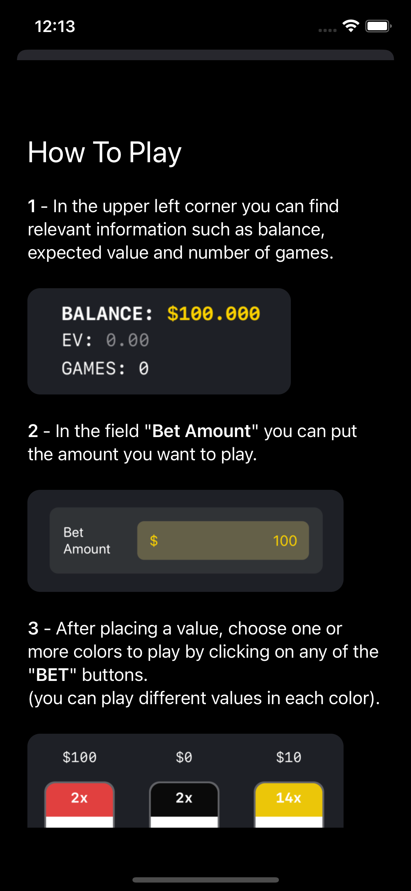
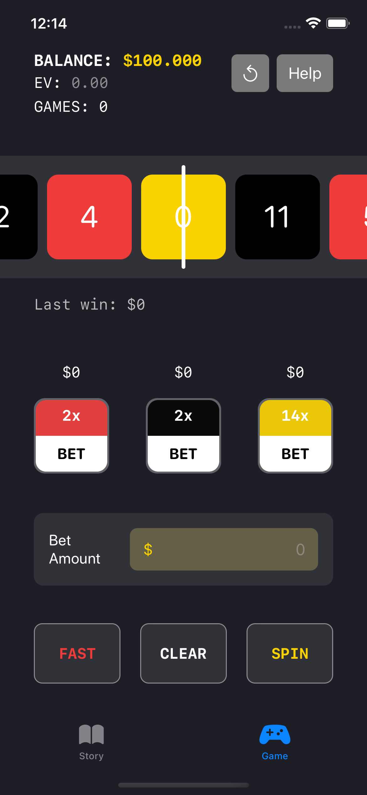

# ExpectMoney (WWDC22)

The main idea behind ExpectMoney is to explain the basics of “Expected Value / Mathematical Expectation” and its application in a casino roulette (online casino). The project consists of two parts, the first being a tab with basic explanations of the theory and a simulation, and the second part a roulette game.

## Preview

Story

 | 

Game

 | 